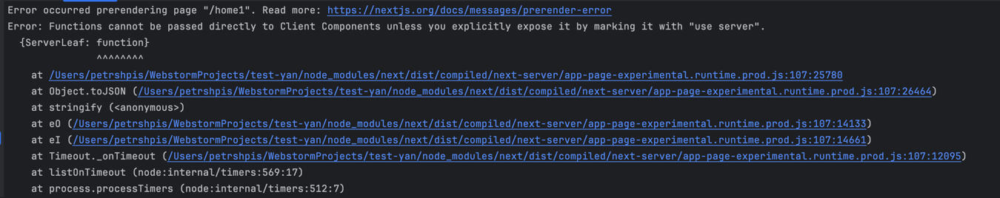
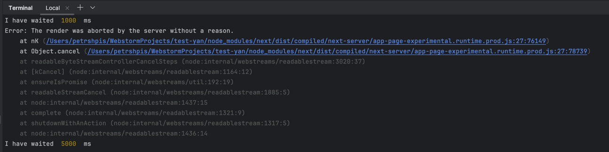

Make demo with render leaf component in server parent and client parent

Вопросы:
- пропс серверный лист в клиентскую мать
- use server и use client откуда
- какая магия реализована реактом, а какая некстом
- что полезного делает некст, кроме реакт сервер компонент
- что делает **_Suspense_** когда дети релоадится и как они общаются
- как общается бэк некста/реакта с фронтом
  - например в саспенсе
- **_renderToPipeableStream_** отличия с renderToStream
- убедиться, что Suspense - точка где реакт сегментирует рендеринг, то есть до него html дадут сразу, а внутри него html прилетит потом по ??вебсокетам??
- Дед серверный, папа-мама серверные, у родителей клиентские дети и дети хотят общаться
- Убедиться что клиенту в пропсы нельзя запустить порождающюю сервеный компонент функцию, но можно вставить уже готовый серверный компонент из пропсов

```
<ServerGranFather>
const fatherServer, motherServer = ...;
<ClientGrandFather props={mother, father}>
{MotherServer}
{Father}
</ClientGrandFather>
</ServerComponent>
```


### Результаты/Выводы
1)  - происходит при попытке перенести инициализацию серверного компонента в клиент
2) Но в клиентскую компоненту можно передать уже сгенеренную серверную и тогда она ее отобразит
3) Серверная компонента может генериться как SSG так и SSR свойствами. Даже одна и та же компонента в зависимости от пропсов может вести себя по разному
4) Страницы не генерятся полностью в формате ssg или ssr. Это означает, что компоненты, которые имеют только статику, могут быть сгенерены как SSG, при том что динамические серверные будут добавлены как SSR только при запросе юзера
5) Убедиться в пункте 3 можно посмотреть на логи npm run build. Также: https://dev.to/peterlidee/nesting-client-and-server-components-in-next-13-7ik
6) Сломался классический инструмент пробрасывания пропсов(см. test-communication)
   - тк общий предок у двух клиентских компонент это серверный дед, то он должен иметь в себе стейты, чтобы пробросить вниз
   - но чтобы у него эти стейты появились ему надо их получить в пропсах
   - а чтобы получить в пропсах, он должен быть создан внутри клиентского, а так делать нельзя


### Таски от 13.10.2023
1) Figure out server actions
2) Directive "use server"
3) What happens with Suspense if there was <AuthGuard> redirect
   What if <AuthGuard> in Suspense
   What if 2 <AuthGuards>
   What if 2 <AuthGuards> in Suspense
4) Suspense renders HTML immediately but ships JSON later via webpack in pure react + webpack no next.js
   https://github.com/lydiahallie/minimal-rsc/tree/master
   https://codesandbox.io/s/kind-sammet-j56ro?file=/src/App.js:231-899

### Ответы

3) - С одним гуардом в саспенсе, некст сначала показывает незасекреченную инфу, а потом уже редиректит после отработки гуарда
   - С двумя гуардами без саспенсов, некст ничего не показывает и ждет пока отработает самый быстрый гуард, после него происходит редирект. Тем не менее второй гуард отрабатывает, что видно в логах, и ошибок не выдает
   - С двумя гуардами каждый в отдельном саспенсе происходит показ не секьюрной инфы и потом редирект по более быстрому саспенсу при этом некст ругается, что рендер оборвался сервером  Ошибка по факту ни на что не влияет и происходит из-за того что когда долгий вернул ответ быстрый уже редиректнул
   - C двумя гуардами в одном саспенсе, происходит чутка жести. В результате всегда будет редирект на ссылку чей гвард был выше в коде. Но когда быстрый гуард выше в коде, то долгого даже не дожидаются и делают редирект. Но когда выше долгий, то сначала срабатывает быстрый, но почему-то редиректа не происходит и некст дожидается долгого и делает редирект по долгому урлу 
   - Чисто по личным ощущениям некст не очень хочет, чтобы саспенсами пользовались и мб поэтому немного странно отрабатывают ошибки и история с двумя редиректами в одном саспенсе чутка не логичная
